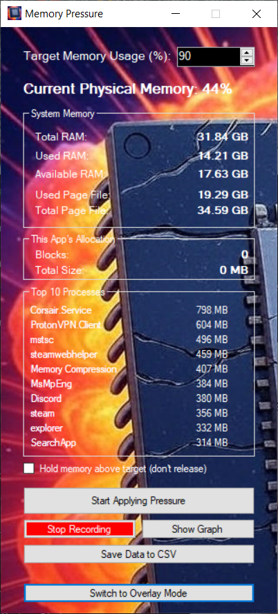

Copyright (c) 2025, Mehuge All rights reserved.

# Memory Pressure

A Windows utility for applying precise physical memory pressure for development, stress testing, and performance analysis.

### What is Memory Pressure?

Memory Pressure is a lightweight yet powerful Windows utility designed for developers, testers, and system analysts who need to simulate specific high-memory conditions. Ever wondered how your application behaves when physical RAM is scarce? Memory Pressure gives you precise control, allowing you to set a target memory usage percentage and watch as it carefully allocates and holds memory to meet that goal.

Beyond stress testing, it's also a comprehensive monitoring tool, providing real-time statistics, data logging, and live graphing capabilities to give you a deep understanding of your system's performance under load.

### Key Features

* **Precise Memory Targeting:** Set a target physical memory usage percentage (e.g., 90%) and the application will allocate memory to reach and maintain that level.

* **Real-Time Monitoring:** Get an instant, detailed view of your system's memory, including:

  * Total, Used, and Available Physical RAM.

  * Committed Memory (Virtual Memory) and Page File usage.

  * Live-updating list of the Top 10 memory-consuming processes.

* **Data Recording & Graphing:**

  * Record key performance metrics over time, including physical memory load, page faults, and page file usage.

  * View the data on a live-updating graph to visualize system performance.

  * Save recorded session data to a `.csv` file for external analysis in tools like Excel.

* **Customizable Overlay Mode:** Switch to a minimalist, semi-transparent, always-on-top overlay window to monitor key stats while you work or run tests.

* **Advanced Settings:** A comprehensive settings panel allows you to customize:

  * The sample interval and the number of data points shown on the graph.

  * Which metrics are visible on the graph.

  * Application startup behavior (e.g., start recording or open the graph automatically).

  * Window positions, which are saved between sessions.

### Installation

You can download the latest compiled release from the [**Releases**](https://github.com/Mehuge/MemoryPressure/releases) page on the right.

### Building from Source

To build the project yourself, you will need:

* Visual Studio 2022 (or later)

* .NET Framework 4.7.2 (or later)

Simply clone the repository and open the `.sln` file in Visual Studio.

### License

This project is licensed under the **MIT License**. See the `LICENSE` file for details.

### Screen Shots
#### Main Window
</img>
#### Memory Usage Graph
</img>
#### Overlay

### Acknowledgements

- Coded entirely by **Gemini 2.5 Pro** prompted by **Mehuge**
- Artwork by **Grok** prompted by **Mehuge**
